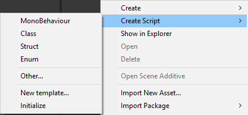
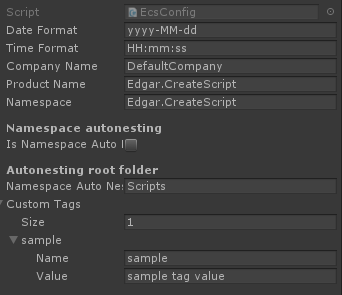
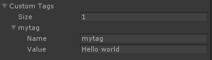
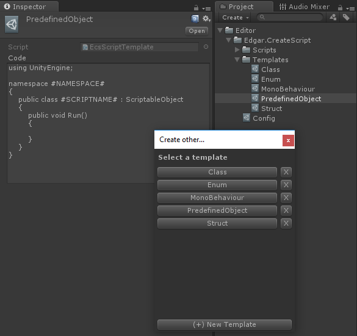

# CreateScript
[Unity3D | Editor]

## Description
Do you use ReSharper? Do you like code templates? Wish Unity had such a feature? You're in the right place.  
CreateScript is a Unity3D editor extension that adds a context menu where you can create a C# script from a template similar to ReSharper script templates in Visual Studio. 

Features:
* Free
* Create scripts from template
* Edit default templates
* Create your own templates
* Use extended preprocessor tags
* Create custom preprocessor tags
* Templates are per-project, share them with your entire team of 1

Tested on `Unity3D 2017.3` but should work on other versions too
## Installation
Either download the unity package and import it or download (clone for you fancy folk) the project and put `Editor/` folder in your own project.

## Upgrading
1) Delete `Scripts/` folder inside `Editor/Edgar.CreateScript/`
2) Import new package  
`⚠ Uncheck Templates/ folder if you don't want default templates to be overwritten ⚠`

## Usage
`Right click in project view > Create Script` and choose the template you wish to create.  
  

**Other...** - opens a window with a list of all templates  
**New template...** - creates a new template  
**Initialize** - creates config and default templates if they don't already exist  
_note: if default templates are not present then context menu items won't work_  

## Default preprocessor tags
* **#DATE#** - current date based on format from Config
* **#TIME#** - current time based on format from Config
* **#COMAPNY#** - static string, initialized from `Application.companyName`
* **#PRODUCT#**  - static string, initialized from `Application.productName`
* **#NAMESPACE#** - static string, initialized from product name but filtered
* **#FILENAME#** - name of the script file with extension
* **#SCRIPTNAME#** - name of the script file without extension

To edit template contents navigate to `Templates/` folder and pick a template you wish to edit. In Inspector view edit the code text area to what you desire. A preprocessor tag must be surrounded with hashsharps `#`.

To change default tag values navigate to Config file in root of the plugin. If this file does not exist, perform `Right click > Create Script > Initialize` action to create it.

### Config file
  
* **Date Format** - format of the date tag. All this does is convert DateTime.Now to this format
* **Time Format** - format of the time tag. -.-
* **Company name** - name of the company/developer
* **Product Name** - name of the game/app/whatever
* **Namespace** - base namespace to be used for all scripts.
* **Namespace autonesting** - if enabled, script folders will be automatically appended to namespace. For example creating a script in `Scripts/Game/Internal` will result in namespace `Namespace.Game.Internal`
* **Autonesting root folder** - the root folder where scripts are stored. For example if you store your scripts in `Scripts/` folder, this will be ignored when constructing namespace.
* **Custom Tags** - any custom preprocessor tags can be added here

## Extending

### Context menu items
The easiest way to add context menu items is using `EcsCustomDefinitions.cs` file.  

To add a context menu item, copy and paste this code into the file:
```cs
[MenuItem("Assets/Create Script/{NAME}", priority = 19)]
private static void Create{NAME}()
{
    EcsScriptTemplate.CreateScript("{TEMPLATENAME}");
}
```
Replace _{NAME}_ with the name you want your item to have and _{TEMPLATENAME}_ with the name of the template that will be created.  
If you wish your menu to appear above default ones, change priority to 17 or 18.  AFAIK Unity does not support dynamic adding/removing of context menus so this is the only way of adding them at this time.  
`EcsMenuItems.cs` contains default context menu items, but editing that file is not recommended.

### Additional template tags
Adding more template tags can be done in two ways: either through `Config` or `EcsCustomDefinitions.cs` file.  
a) **Config approach**  
If your custom tag values are going to be static strings, it is recommended to use `Config` approach.  
Click on Config file in plugin root folder and in `Custom Tags` field add 1 or more tag. Name of the tag is what you will use in the script and value is what it will be replaced with.  
  

b) **EcsCustomDefinitions.cs approach**  
If your custom tag needs some sort of dynamic code backing, use `ProcessPreProcessor(EcsPreProcessor p)` function in `EcsCustomDefinitions.cs` file. This function is called when a new preprocessor is created, before it preprocesses the code file. Parameter `p` contains a reference to said preprocessor where you can access its properties.  
For example, to add a new tag add this line inside the function:  
```cs
p.Tags.Add("custom", "put value here");
```

## Screenshots
  
  
